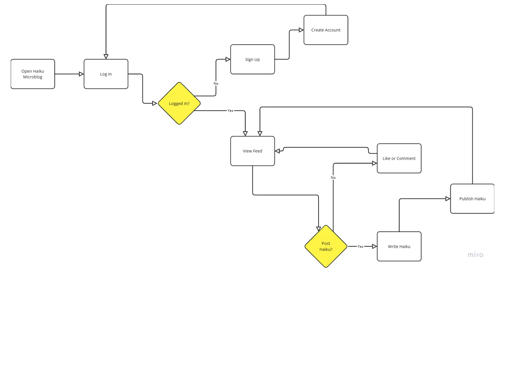

# Hai.ku

---

Hai.ku is a minimalist microblogging app, by constraining the content of posts to the 5-7-5 syllable haiku structure it challenges the user to express themselves within such a laconic form. The project was inspired by the original 140 character limit on twitter and the  Lars von Trier, Jørgen Leth film [The Five Obstructions](https://en.wikipedia.org/wiki/The_Five_Obstructions).

- [Link to live project](https://haiku-microblog-ff81dfcf5cfd.herokuapp.com/)

---

## Table of Contents

- [Hai.ku](#haiku)
  - [Table of Contents](#table-of-contents)
  - [UX/UI](#uxui)
      - [Target Audience](#target-audience)
      - [User Stories](#user-stories)
      - [Design](#design)
      - [Wireframes](#wireframes)
        - [Mobile](#mobile)
        - [Tablet](#tablet)
        - [PC](#pc)
      - [User Flow Diagram](#user-flow-diagram)
  - [Database Structure](#database-structure)
      - [Essential Schema](#essential-schema)
        - [Profile](#profile)
        - [Post](#post)
        - [Likes](#likes)
      - [ERD](#erd)
  - [Features](#features)
      - [Implemented Features](#implemented-features)
      - [Future Additions](#future-additions)
  - [Agile Methodologies](#agile-methodologies)
      - [Acceptance Criteria/User Stories](#acceptance-criteriauser-stories)
      - [Kanban Board](#kanban-board)
  - [Use of AI](#use-of-ai)
  - [Deployment](#deployment)
    - [Local Developement](#local-developement)
    - [Deployment to Heroku](#deployment-to-heroku)
  - [Testing](#testing)
      - [HTML](#html)
      - [CSS](#css)
      - [JavaScript](#javascript)
      - [Python / Unit tests](#python--unit-tests)
      - [Lighthouse](#lighthouse)
  - [Manual Testing](#manual-testing)
  - [Technologies Used](#technologies-used)
  - [Credits](#credits)

---

## UX/UI

#### Target Audience

-Writers and Poets: People who enjoy experimenting with words, exploring creative constraints, and crafting meaningful, concise expressions.

-Creative Thinkers: Artists, designers, and creative professionals who appreciate challenges as a way to foster innovation.

-Mindfulness Enthusiasts: Individuals seeking moments of calm, reflection, and mindfulness through the meditative nature of haiku-writing.

-Social Media Users Seeking Novelty: Those looking for a unique and refreshing alternative to traditional microblogging platforms.

-Educators and Students: Teachers and learners interested in using the platform as a tool to explore creative writing, language, and the beauty of constraints.

#### User Stories

[associated project board](https://github.com/users/w1zzball/projects/7)

- User Story: As a new user, I want to sign up and create an account so that I can start sharing my haikus.

- As a user, I want to create a haiku post so that I can share my thoughts and creativity with the community.

- As a user, I want to see a feed of haikus so that I can enjoy and engage with the creativity of others.

- As a user, I want to like haikus so that I can show appreciation for the posts I enjoy.

- As a user, I want to comment on haikus so that I can express my thoughts and engage with the creator.

- As a user, I want insights on the performance of my haikus so that I can understand which posts resonate most with others.

- As a user, I want to search for haikus by keywords, themes, or authors so that I can find specific content.

#### Design

Given the simplicity and clarity of the haiku form, it feels natural that the website design should be likewise minimal and unobtrusive, as such I have opted for a  clear style and an easy to read font, I had originally planned to use a light theme but after accessibility testing I changed the styling to a darker blue hued theme for easier legibility and reduced eye-strain.

#### Wireframes

Initial wireframes made using Balsamiq

##### Mobile

The site was designed using a mobile first approach


##### Tablet


##### PC


---
#### User Flow Diagram



---

## Database Structure

#### Essential Schema

The core of the microblog uses two models profile and post.

##### Profile

The custom profile model extends the default user model supplied by django with fields for a user bio and user uploaded profile image hosted using Cloudinary. As it depends upon the user model it is created when the user model is created and similarly updated when the user is updated using the `@reciever` decorator in the model definition. It also is deleted if the corresponding user is deleted

| field       | value                                                | explanation            |
| ----------- | ---------------------------------------------------- | ---------------------- |
| user        | models.OneToOneField(User, on_delete=models.CASCADE) | instance of user model |
| bio         | models.TextField(max_length=500, blank=True)         | text field for bio     |
| profile_pic | CloudinaryField('image', default='placeholder')      | cloud hosted image     |

##### Post

The post model holds the users posts. It is linked to the posters profile and will be deleted upon deletion of the the posters profile, it also contains information on the posts creation date

| field      | value                                                                                 | explanation                          |
| ---------- | ------------------------------------------------------------------------------------- | ------------------------------------ |
| body       | models.TextField()                                                                    | content of the post                  |
| created_at | models.DateTimeField(auto_now_add=True)                                               | timestamp when post was created      |
| author     | models.ForeignKey('profiles.Profile', on_delete=models.CASCADE, related_name='posts') | link to profile who created the post |

##### Likes

The Likes model saves when a user likes a post

| Field | Value | Explanation |
|-------|--------|-------------|
| user | ForeignKey('profiles.Profile') | References the Profile model that created the like. Uses CASCADE deletion to remove likes when a user is deleted. |
| post | ForeignKey('Post') | References the Post being liked. Uses CASCADE deletion to remove likes when a post is deleted. Has a related_name of 'likes_set' for reverse lookups. |
| created_at | DateTimeField | Automatically set when the like is created (auto_now_add=True). Records when the like was made. |
| Meta class | unique_together = ('user', 'post') | Ensures a user can only like a post once by preventing duplicate combinations of user and post. |


#### ERD


---

## Features

#### Implemented Features

- User Authentication & Profile Management
  - User registration and login system
  - Profile creation and customization
  - Profile picture upload and management via Cloudinary
  - Profile deletion capability
  - Public profile viewing

- Post Management
  - Create, edit and delete posts
  - AJAX-powered posting for seamless user experience
  - Haiku validation system ensuring proper syllable structure (5-7-5)
  - Homepage feed showing all users' posts
  - Input sanitization and cleaning
  - Dynamic syllable counting to give feedback when entering text

- Like system
  - Users can like/unlike posts with a single click
  - Like status visually indicated with filled/outlined heart icon
  - Real-time like count updates without page refresh
  - Optimistic UI updates (shows changes immediately before server confirmation)

#### Future Additions

- Social Features
  - Follow/unfollow other users
  - Comment system on posts
  - Private messaging between users
  - Share posts functionality
- Profile Enhancements
  - Private/public profile toggle
  - Custom themes/styling for individual profiles
  - Profile statistics (posts count, likes received, etc.)
  - Achievement/badge system for active users
- Content Features
  - Categorize haikus by themes/topics
  - Search functionality for posts and users
  - Trending haikus section
  - Seasonal themes and prompts
- Educational Components
  - Tutorial section for haiku writing
  - Writing prompts and challenges
  - Resources about haiku history and structure

---

## Agile Methodologies

#### Acceptance Criteria/User Stories
After the initial ideation I wrote a few possible user stories and using microsoft copilot I refined these rough sketches into actionable task lists, with acceptance criteria and what tasks needed to be done to meet them. These were then added to a Kanban Board.

#### Kanban Board
[associated project board](https://github.com/users/w1zzball/projects/7)
To help streamline design and pinpoint key features I employed a Kanban Board to track my progress and used the MoSCoW prioritisation method to sort tasks by how essential they were to the minimum viable product. This was impemented using githubs built in project boards, using custom labels to sort which items were must have/should have/could haves. 

---
## Use of AI

Github's Copilot AI was used to give suggestions for features or improvements, these were then refined and implemented. Here are some examples of how AI was utilised:

- **Suggestion of novel methods** : Asking for advice on the implementaion of post creation, copilot suggested using AJAX to implement dynamic loading of new elements without full page refreshes. I had no experience with the XHR API and after consulting the MDN documentation and some guides I implemented the post CRUD functionality with AJAX. Using copilot to diagnose and troubleshoot errors as I went. 
- **Generating model data** : To test the like, profile view and post feeds I needed multiple database entries. Manually creating these would have been tedious and as such I instead dumped my database into a json file which I then gave as context to copilot with a prompt of the form "use this database structure to construct test data, there should be at least 5 accounts, each having at least 3 posts, each post being a haiku...". The test data was then loaded back into the database allowing me to test for problems with larger scale data interacting with templates etc.
- **Generating test data** : To test the haiku validation code I wrote a main guard entrypoint into the haiku_helpers.py module which would take test haiku and log out validation results. To test this I used microsofts copilot web app to generate larger sets of haiku which I then fed into the validator and based on the results I refined the validator for edge cases.
- **Refactoring CSS** : As my project grew larger, the single stylesheet I had been using began to grow to cumbersome size, I decided to refactor the stylesheet into multiple modular components, each responsible for a specific aspect of the app; which could then be included only where necessary. I prompted copilot to split up my styles.css file into a few components "base", "posts", "profiles" etc. It then copied the relevant parts of the stylesheet into their own modules. I then manually reviewed the new files to make sure no actual content had been changed and that the correct css rules where in the correct files.

---
## Deployment

The project was deployed locally for initial testing and development then later to heroku, both local and remote deployments were kept up to date with oneanother so each could be used as a reliable model for refinement.

### Local Developement
To deploy locally follow these steps-
1. Clone the Repository, run

   - `git clone https://github.com/w1zzball/haiku.git`
   - `cd haiku`

2. Set Up a Virtual Environment, run
   - `python -m venv venv`
   - `source venv/bin/activate  # On Windows: venv\Scripts\activate`

1. Install Dependencies, run

   - `pip install -r requirements.txt`

2. Set Up Environment Variables
   - Create a env.py file in the root directory with contents:
      ```
      import os
      os.environ.setdefault("KEY","VALUE")
      ...
      ```
      key / values to supply
     - `SECRET_KEY=your_secret_key`
     - `DEBUG=foo #any non null value will enable debug mode as the settings.py file looks to see if any value exists.` 
     - `CLOUDINARY_URL=your_cloudinary_url`
     - `DATABASE_URL=your_database_url`

3. Apply Migrations, run
   - `python manage.py migrate`
4. Run the Development Server, run
    - `python manage.py runserver`
---
### Deployment to Heroku
1. Create a Heroku Account and New App
   - Sign up at Heroku
   - Create a new app with a unique name
   - Select the relevant region
2. Configure Environment Variables
   - In Heroku dashboard, go to "Settings" > "Config Vars"
   - Add the following variables:
      - `SECRET_KEY`: Your Django secret key
      - `CLOUDINARY_URL`: Your Cloudinary URL
      - `DATABASE_URL`: Your Database URL
  - **DO NOT** set a debug variable
3. Prepare for Deployment
   - Create a Procfile in your project root, add
   - `web: gunicorn haiku.wsgi`
   - Ensure requirements.txt is up-to-date, run
   - `pip freeze > requirements.txt`
4. Deploy to Heroku
   - Connect your GitHub repository:
     - In Heroku dashboard, go to "Deploy"
     - Choose "GitHub" as deployment method
     - Connect to your repository
   - Enable automatic deploys or deploy manually from your main branch
---

## Testing

#### HTML

Running the home, account and post pages generated from my templates through the WC3 HTML validator returns no errors.

#### CSS

W3C CSS validator returns no errors on any of the static css components.

#### JavaScript

#### Python / Unit tests

#### Lighthouse

- The homepage recieves a greater than or equal to 99/100 on all lighthouse metrics
- Individual post urls recieve high (>92) scores on all lighthouse metrics barring 'best practices' which is penalised for the use of third party cookies which are being imported by cloudinary
- Profile pages likewise recieve high scores excepting for the cloudinary cookies dragging down the best practices score
- User Posts page recieves either 100 or high 90s as it does not include cloudinary content

## Manual Testing


The following table details the manual testing performed on the application: 

| Context    | Feature         | Action                                   | Effect                                            | Tested |
| ------- | --------------- | ---------------------------------------- | ------------------------------------------------- | ------ |
| Site Wide    | Navigation      | Click on Logo                            | Redirects to home page                            | ✅    |
| Site Wide    | Individual Post Page      | Click on Post's text         | Redirects to post's unique URL                            | ✅    |
| Logged Out    | Login       | Click on Login link       | Redirects to login page                | ✅     |
| Logged Out    | Sign Up     | Click on Sign Up link                        | Redirects to registration page                    | ✅     |
| Logged In    | Log Out         | Click on Log Out link                  | Redirects to logout page         | ✅     |
| Logged In    | New Post  |    Click on Plus button   |       Opens create new post overlay      | ✅     |
| Logged In    |  Like Post  |   Click the heart button on unliked post    |    Like is registered and heart changes colour to give feedback    | ✅     |
| Logged In    |  Unlike Post   |   Click the heart button on liked post    |  Like is removed and heart changes colour to give feedback   | ✅     |
| Logged In    | Edit Post   |  Click the Edit Button on a post   |     Opens edit post overlay   | ✅     |
| Logged In    | Delete Post   |  Click the Delete Button on a post   |     Opens delete post confirmation   | ✅     |
| New Post    | Cancel   |     Click on cancel button         |     Closes create new post overlay        | ✅     |
| New Post    |  Post validation  |  Click on save with inccorect content (non haiku)  |  Error message shown, post not submitted  | ✅     |
| New Post    | Post Submission |  Click on save with correct content    |  Post submitted message shown, post submitted, UI updated    | ✅     |
| Edit Post    | Cancel   |     Click on cancel button         |     Closes edit post overlay        | ✅     |
| Edit Post    |  Post validation  |  Click on save with inccorect content (non haiku)  |  Error message shown, edit not submitted  | ✅     |
| Edit Post    | Post Submission |  Click on save with correct content    |  Post edited message shown, edit submitted, UI updated    | ✅     |
| Delete Post    | Cancel   |     Click on Cancel button         |     dismisses delete confirmation        | ✅     |
| Delete Post    | Delete   |     Click on Okay button         |     Post Deleted in database and UI         | ✅     |
| Profile | Profile Picture |  Upload new image                         | Updates profile picture in database and UI        | ✅     |
| Profile | Edit Bio             | Edit and save bio text                   | Updates bio in database and UI                    | ✅     |
| Profile | Delete Profile |   Click on Delete profile button    |     Opens delete profile confirmation     | ✅     |
| Delete Profile    | Cancel   |     Click on Cancel button         |     dismisses delete confirmation        | ✅     |
| Delete Profile    | Delete   |     Click on Confirm button         |     Profile Deleted in database and User redirected to homepage         | ✅     |
| Log Out Page   |   Sign Out Button   |   Click sign out button     |     User logged out and redirected to homepage   | ✅     |
| Log In Page    |  Login validation  |  Click Login button with incorrect credentials     |   user prompted to enter correct credentials  | ✅     |
| Log In Page    |  Login validation  |  Click Login button with correct credentials     |   User logged in and redirected to homepage      | ✅     |
| Sign Up Page    | Sign Up validation | Click sign up button with incorrect credentials   |    User prompted to enter correct credentials  | ✅     |
| Sign Up Page    | Sign Up validation |  Click sign up button with correct credentials  |   Account created, user logged in and redirected to homepage  | ✅     |
| Mobile | Responsive Design | View site on multiple screen sizes | Layout adapts appropriately | ✅ |

## Technologies Used

- HTML5
- CSS3
- JavaScript
- Python
- Django
- PostgreSQL - main database
- Cloudinary
- Whitenoise
- Balsamiq - for creating wireframes
- dbdiagram.io - for creating ERD diagrams 
- Miroboard - for creating a user flow diagram
- Favicon.io - for creating a favicon
- coolers.co - for creating colour palattes 

---

## Credits
