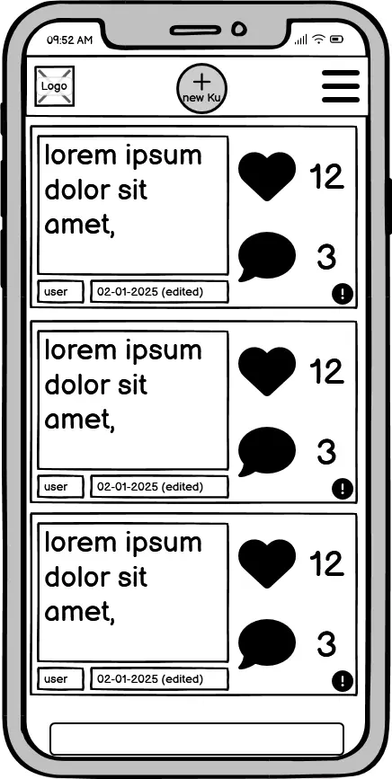
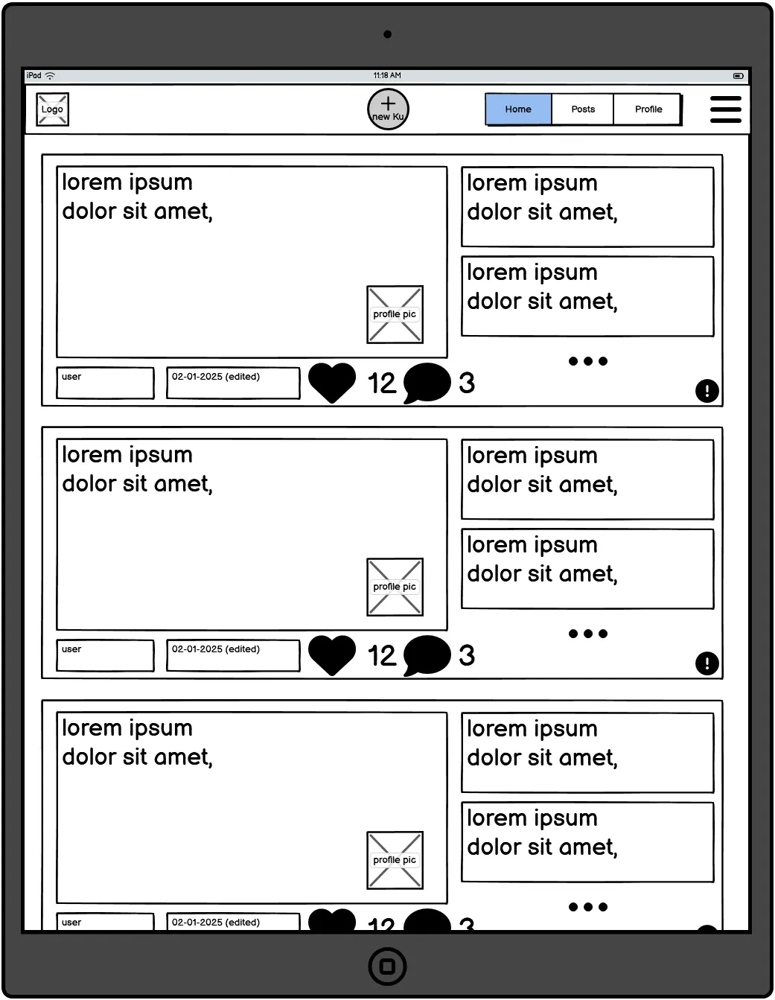
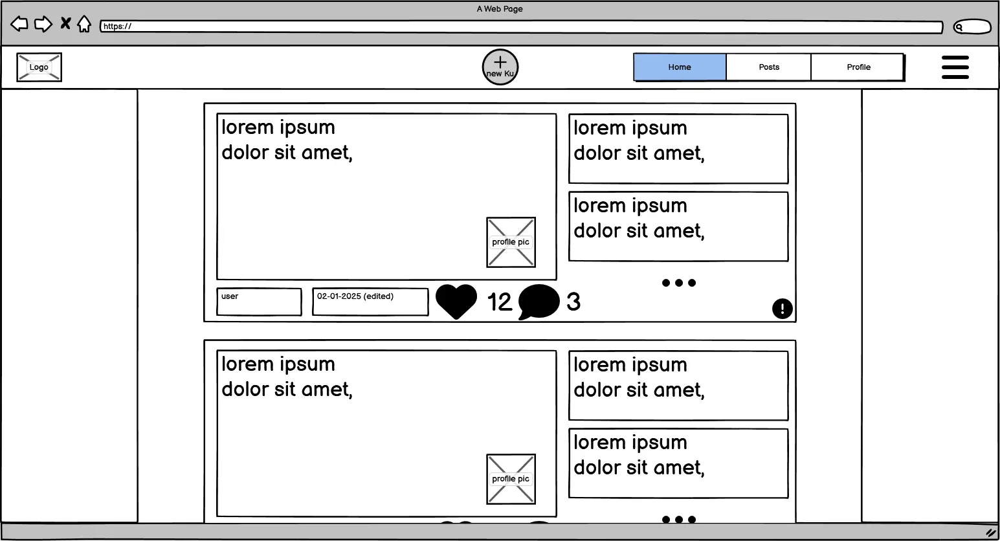

# Haiku Microblog

---

description of site

- [Link to live project](https://haiku-microblog-ff81dfcf5cfd.herokuapp.com/)

---

## Table of Contents

- [UX/UI](#uxui)
  - [Target Audience](#target-audience)
  - [User Stories](#user-stories)
  - [Design](#design)
  - [Wireframes](#wireframes)
- [Database Structure](#database-structure)
  - [ERD](#erd)
- [Features](#features)
  - [Implemented Features](#implemented-features)
  - [Future Additions](#future-additions)
- [Agile Methodologies](#agile-methodologies)
  - [Kanban Board](#kanban-board)
- [Deployment](#deployment)
- [Testing](#testing)
  - [HTML](#html)
  - [CSS](#css)
  - [JS](#javascript)
  - [Python / Unit tests](#python--unit-tests)
  - [Lighthouse](#lighthouse)
  - [Manual Testing](#manual-testing)
- [Technologies Used](#technologies-used)
- [Credits](#credits)

---

## UX/UI

#### Target Audience

-Writers and Poets: People who enjoy experimenting with words, exploring creative constraints, and crafting meaningful, concise expressions.

-Creative Thinkers: Artists, designers, and creative professionals who appreciate challenges as a way to foster innovation.

-Mindfulness Enthusiasts: Individuals seeking moments of calm, reflection, and mindfulness through the meditative nature of haiku-writing.

-Fans of Structured Creativity: Inspired by the concepts in The Five Obstructions, these are people who enjoy working within boundaries to unlock new perspectives and ideas.

-Social Media Users Seeking Novelty: Those looking for a unique and refreshing alternative to traditional microblogging platforms.

-Educators and Students: Teachers and learners interested in using the platform as a tool to explore creative writing, language, and the beauty of constraints.

#### User Stories

(Expanded on in [associated project board](https://github.com/users/w1zzball/projects/7))

- User Story: As a new user, I want to sign up and create an account so that I can start sharing my haikus.

- As a user, I want to create a haiku post so that I can share my thoughts and creativity with the community.

- As a user, I want to see a feed of haikus so that I can enjoy and engage with the creativity of others.

- As a user, I want to like haikus so that I can show appreciation for the posts I enjoy.

- As a user, I want to comment on haikus so that I can express my thoughts and engage with the creator.

- As a user, I want insights on the performance of my haikus so that I can understand which posts resonate most with others.

- As a user, I want to search for haikus by keywords, themes, or authors so that I can find specific content.

#### Design

#### Wireframes

Initial wireframes made using Balsamiq

##### Mobile

The site was designed using a mobile first approach

##### Tablet

##### PC

---

## Database Structure

#### Essential Schema

The core of the microblog uses two models profile and post.

##### Profile

The profile model extends the default user model supplied by django with fields for a user bio and user uploaded profile image hosted using Cloudinary. As it depends upon the user model it is created when the user model is created and similarly updated when the user is updated using the `@reciever` decorator in the model definition. It also is deleted if the corresponding user is deleted

| field       | value                                                | explanation            |
| ----------- | ---------------------------------------------------- | ---------------------- |
| user        | models.OneToOneField(User, on_delete=models.CASCADE) | instance of user model |
| bio         | models.TextField(max_length=500, blank=True)         | text field for bio     |
| profile_pic | CloudinaryField('image', default='placeholder')      | cloud hosted image     |

##### Post

The post model holds the users posts. It is linked to the posters profile and will be deleted upon deletion of the the posters profile, it also contains information on the posts creation date, and how many likes the post has

| field      | value                                                                                 | explanation                          |
| ---------- | ------------------------------------------------------------------------------------- | ------------------------------------ |
| body       | models.TextField()                                                                    | content of the post                  |
| created_at | models.DateTimeField(auto_now_add=True)                                               | timestamp when post was created      |
| author     | models.ForeignKey('profiles.Profile', on_delete=models.CASCADE, related_name='posts') | link to profile who created the post |
| likes      | models.PositiveIntegerField(default=0)                                                | number of likes on the post          |

#### ERD

---

## Features

#### Implemented Features

- users can create an account
- users can log in
- anyone can view profiles
- homepage shows users posts
- users can create posts (using ajax for seamless posting)

#### Future Additions

- set profile to private

## Agile Methodologies

#### Kanban Board

---

## Deployment

- deployed to heroku

---

## Testing

#### HTML

#### CSS

#### JavaScript

#### Python / Unit tests

#### Lighthouse

#### Manual Testing

---

## Technologies Used

-HTML5
-CSS3
-JavaScript
-Python
-Django
-PostgreSQL
-Cloudinary
-Whitenoise
-Balsamiq
-dbdiagram.io

---

## Credits
